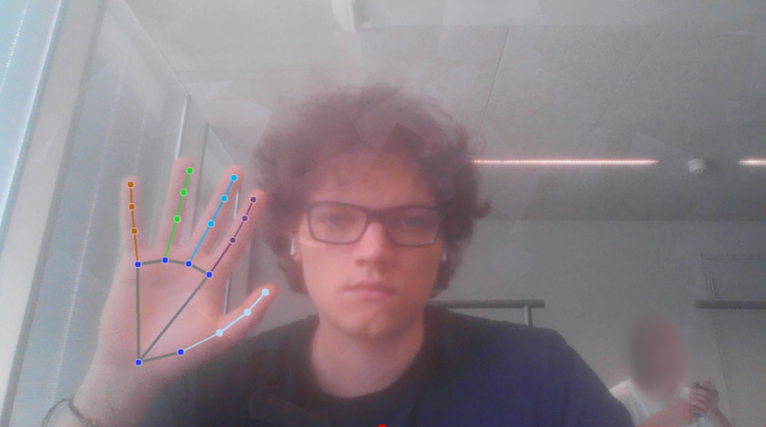
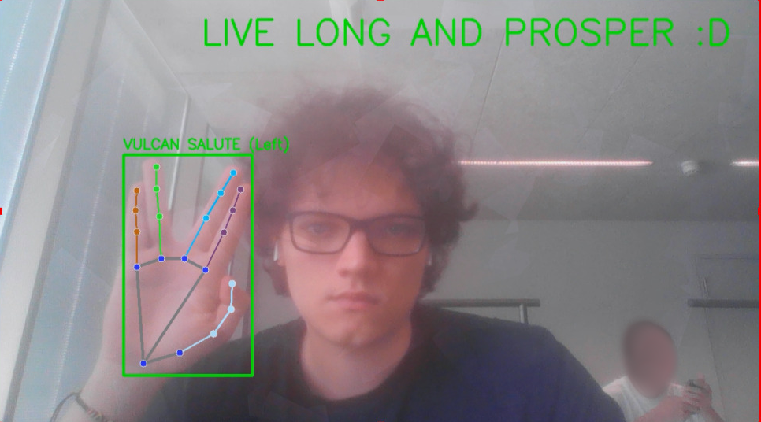

# Computer Vision Project

## Features

### Basic Image Processing
- **Statistical Analysis**: Real-time calculation of mean, mode, standard deviation, min/max values for each RGB channel
- **Linear Transformations**: Adjustable brightness and contrast with preset configurations
- **Histogram Processing**: Live histogram display with equalization capabilities
- **Entropy Calculation**: Information content analysis for each color channel

### Advanced Filters
- **Gaussian Blur**: Smoothing filter with configurable kernel size
- **Sharpen Filter**: Edge enhancement using convolution kernel
- **Edge Detection**: Canny edge detection with RGB output
- **Histogram Equalization**: Automatic contrast enhancement

### Special Features
- **Hand Detection**: Real-time hand landmark detection using MediaPipe
- **Vulcan Salute Recognition**: Advanced gesture detection with visual feedback
- **Live Statistics Overlay**: Real-time display of image statistics and filter status


## Requirements

- **Python**: 3.10 (managed via pyenv + pyenv-virtualenv)
- **Operating System**: Linux (tested on Arch-based systems), Windows, macOS
- **Additional Software**: OBS Studio (for testing virtual camera functionality)
- **Python Version Manager**: pyenv with pyenv-virtualenv plugin

## 📦 Installation

### 1. Install Python 3.10 with pyenv

This project requires Python 3.10. Use pyenv with the virtualenv plugin to manage the Python version, due to mediapipe dependencies.

For more information about how to install pyenv and pyenv-virtualenv, see the documentation for both:
- [pyenv](https://github.com/pyenv/pyenv)
- [pyenv-virtualenv](https://github.com/pyenv/pyenv-virtualenv)

#### Install pyenv
```bash
# On Arch/EndeavourOS
sudo pacman -S pyenv

# On Ubuntu/Debian
curl https://pyenv.run | bash

# On macOS
brew install pyenv
```

#### Install pyenv-virtualenv as a plugin
```bash
git clone https://github.com/pyenv/pyenv-virtualenv.git $(pyenv root)/plugins/pyenv-virtualenv
```

#### Configure shell (add to ~/.zshrc or ~/.bashrc)
```bash
eval "$(pyenv init - zsh)"
eval "$(pyenv virtualenv-init -)"
export PYENV_ROOT="$HOME/.pyenv"
[[ -d $PYENV_ROOT/bin ]] && export PATH="$PYENV_ROOT/bin:$PATH"

```

#### Install and set Python 3.10
```bash
# Reload shell configuration
source ~/.zshrc  # or source ~/.bashrc

# Install Python 3.10
pyenv install 3.10.12

# Verify installation
pyenv versions
```

### 2. Clone the Repository
```bash
git clone git@github.com:viniciusbregoli/computer-vision-project.git
cd computer-vision-project
```

### 3. Create Virtual Environment with pyenv
```bash
# Create virtual environment using Python 3.10
pyenv virtualenv 3.10.12 computer-vision-project

# Activate the virtual environment
pyenv activate computer-vision-project

# Set local Python version for this project
pyenv local computer-vision-project
```

### 4. Install Dependencies
```bash
pip install -r requirements.txt
```

### 5. System-Specific Setup

#### Linux (Arch)
```bash
# Install v4l2loopback for virtual camera support
sudo pacman -S v4l2loopback-dkms
sudo modprobe v4l2loopback devices=1 video_nr=20 card_label="VirtualCam" exclusive_caps=1
```

#### Windows
- Install OBS Studio
- Ensure OBS Virtual Camera is available

#### macOS
- Install OBS Studio or similar virtual camera software

### 6. Verify Installation
```bash
# Check Python version (should show 3.10.x)
python --version

# Check that you're in the correct virtual environment
pyenv version

# Run the application
python run.py

# Maybe it is necessary to run as sudo
sudo $(which python) run.py
```

## Usage


The application will:
1. Initialize the virtual camera on `/dev/video20` (Linux). if you are using Windows or macOS, remove the `device` parameter from the `vc.virtual_cam_interaction` call in `run.py`
2. Start capturing from the webcam
3. Display real-time processing controls


## ⌨️ Controls

| Key | Function |
|-----|----------|
| `n` | Toggle Hand Detection |
| `g` | Toggle Debug Mode (detailed gesture detection info) |
| `h` | Toggle Histogram Display |
| `s` | Toggle Statistics Overlay |
| `b` | Toggle Blur Filter |
| `p` | Toggle Sharpen Filter |
| `d` | Toggle Edge Detection |
| `e` | Toggle Histogram Equalization |
| `t` | Toggle Linear Transformation |
| `1-4` | Linear transformation presets (when transform is active) |
| `q` | Quit Application |

### Linear Transformation Presets
- **1**: Identity (a=1.0, b=0) - Original image
- **2**: Brighten (a=1.5, b=50) - Increased brightness and contrast
- **3**: Darken (a=0.7, b=-20) - Reduced brightness
- **4**: High Contrast (a=2.0, b=0) - Maximum contrast

## Hand Detection Features

The hand detection system uses MediaPipe for real-time tracking.

### Vulcan Salute Detection
The system can detect the iconic Star Trek Vulcan salute gesture with high accuracy:
- Analyzes finger positioning and separation
- Validates proper finger grouping (index+middle, ring+pinky)
- Provides visual feedback with green bounding box
- Displays "LIVE LONG AND PROSPER :D" message when detected




## Configuration

### Camera Settings
Edit `run.py` to modify default settings:
```python
width = 1280      # Output resolution width
height = 720      # Output resolution height
fps = 30          # Target frame rate
camera_id = 0     # Webcam device ID
```

### Hand Detection Parameters
Modify `HandDetector` initialization in `run.py`:
```python
hand_detector = HandDetector(
    max_num_hands=2,                    # Maximum hands to track
    min_detection_confidence=0.7,       # Detection threshold
    min_tracking_confidence=0.5,        # Tracking threshold
    debug=False                         # Debug output
)
```

### Virtual Camera Device
For Linux systems, specify the virtual camera device:
```python
vc.virtual_cam_interaction(
    custom_processing(vc.capture_cv_video(0, bgr_to_rgb=True)),
    device="/dev/video20"  # Adjust device path as needed
)
```